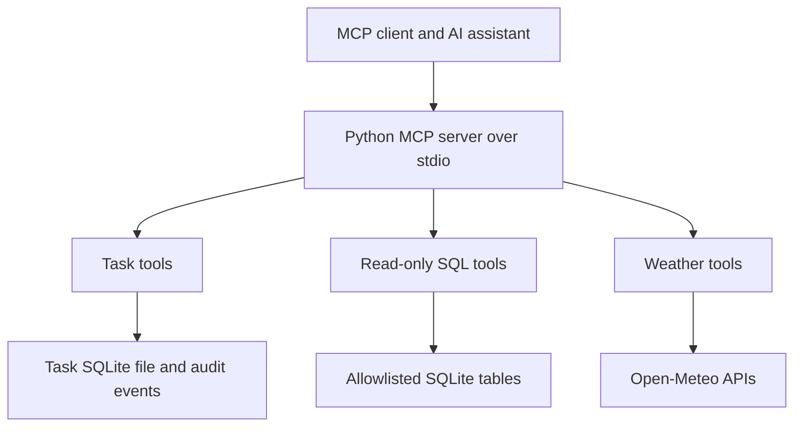

# Personal Workspace MCP Server

A Python MCP server that gives an AI assistant three practical capabilities: manage personal tasks, answer questions from a local SQLite database, and retrieve weather forecasts.

The server uses the official Model Context Protocol Python SDK. Natural-language interpretation happens in your MCP client: the assistant reads the schema, selects a tool and supplies validated arguments. This project does not contain a hidden chatbot or require an LLM API key.

## What it does

- **Tasks:** create, search, filter, update, complete, archive and restore tasks. SQLite persists data between sessions. Version checks prevent stale updates, and every change records an audit event.
- **Database questions:** expose a configured SQLite database through schema resources and bounded read-only queries. Only explicitly allowed tables are visible.
- **Weather:** search locations and retrieve current modeled weather plus up to seven forecast days from Open-Meteo. Results retain units, source and retrieval time.

Example requests in an MCP-capable assistant:

> Create a high-priority task to review my assignment, due on 2026-10-10.

> Show unfinished tasks due before 2026-10-12.

> How many tasks do I have in each status?

> Find Harare in Zimbabwe and show the next three days of weather.

> Which sample courses have more than 12 credits?

## Quick start

Requires Python 3.11 or newer.

```bash
git clone https://github.com/Jemade/MCP-SERVER.git
cd MCP-SERVER
python -m venv .venv
source .venv/bin/activate
# Windows PowerShell: .venv\Scripts\Activate.ps1
python -m pip install -e ".[dev]"
python examples/smoke_client.py
```

Start the server:

```bash
personal-mcp --task-db ./data/tasks.db
```

The server communicates over **stdio**. Waiting silently for client messages is normal; it is not a browser application. Connect it to an MCP client to interact.

## Connect an AI assistant

For clients supporting the common `mcpServers` configuration, use absolute paths. Replace the example paths with your actual checkout and Python executable.

```json
{
  "mcpServers": {
    "personal-workspace": {
      "command": "/absolute/path/MCP-SERVER/.venv/bin/python",
      "args": ["-m", "personal_mcp.server"],
      "env": {
        "TASK_DB_PATH": "/absolute/path/MCP-SERVER/data/tasks.db"
      }
    }
  }
}
```

On Windows, use the absolute `.venv\\Scripts\\python.exe` path and escaped backslashes in JSON. Restart the client after editing its configuration. Exact configuration locations vary by client.

You can also inspect the server without an LLM:

```bash
npx -y @modelcontextprotocol/inspector .venv/bin/python -m personal_mcp.server --task-db ./data/tasks.db
```

Approve task mutations in your client. Tool annotations and prompts guide the client, but approval enforcement belongs to the host application.

## Query a separate SQLite database

Create the demonstration database:

```bash
python examples/create_sample_database.py
personal-mcp --task-db ./data/tasks.db --query-db ./data/sample_courses.db --tables courses
```

The catalog is **fictional sample data**, not an official University of Zimbabwe catalog. You can substitute an existing database and a comma-separated allowlist such as `--tables courses,departments`.

For a configured client, add:

```json
{
  "QUERY_DB_PATH": "/absolute/path/MCP-SERVER/data/sample_courses.db",
  "QUERY_ALLOWED_TABLES": "courses"
}
```

Read `database://schema` first, then query with placeholders:

```sql
SELECT code, title, credits FROM courses WHERE credits > ? ORDER BY code
```

Pass `parameters: [12]`. The returned `columns` correspond positionally to each array in `rows`. If `truncated` is true, narrow the query or aggregate results before answering.

## Tool reference

| Tool | Purpose |
|---|---|
| `create_task` | Create a task with optional deadline and priority |
| `list_tasks` | Filter and paginate tasks |
| `get_task` | Read one task and its current version |
| `update_task` | Change supplied fields with an expected version |
| `archive_task` | Hide a task without deleting it |
| `restore_task` | Restore an archived task |
| `task_history` | Read the latest 100 audit events |
| `database_schema` | Describe allowlisted tables |
| `query_database` | Execute one bounded read-only query |
| `search_locations` | Return up to five candidate locations |
| `weather_forecast` | Fetch weather for selected coordinates |

Resources: `database://schema`, `tasks://overview`.

Prompts: `plan_day(day)`, `analyze_database(question)`.

Task statuses: `todo`, `in_progress`, `done`. Priorities: `low`, `medium`, `high`. Deadlines use `YYYY-MM-DD`; audit timestamps use UTC. To remove a deadline, call `update_task` with `clear_due_date: true`.

## Architecture



The task database and query database can be the same file or separate files. Weather is the only outbound integration. No frontend, remote account system or public HTTP endpoint is included.

## Safety and operating limits

- Task SQL uses bound parameters. Task updates use optimistic concurrency.
- Query connections open in read-only mode. A SQLite authorizer rejects writes, PRAGMAs, attachments, access to other tables and unapproved functions. Arbitrary views and recursive queries are not supported.
- Queries are limited to 10,000 SQL characters, 200 rows, roughly 100 KB of serialized row data and a one-second execution budget. SQLite value size is capped at 1 MB.
- Weather requests use fixed HTTPS endpoints, a ten-second timeout, bounded response bodies, up to three attempts for temporary failures and a five-minute cache.
- The cache is per process, holds at most 128 entries and is not a distributed quota system.
- This is a **single-user local server**. It inherits the permissions of the user running it. It is not a sandbox for executing code and should not be published as an unauthenticated remote service.
- Allowlisting tables exposes all readable columns in those tables. Use a sanitized database when some columns contain information you do not want to share with your assistant.
- Treat database text and API results as untrusted data. The prompts advise this, but they cannot guarantee an AI client will resist prompt injection.
- Back up task data with SQLite's backup API or stop the process before copying the database and associated WAL files.

## Weather provider

Open-Meteo's public API does not require a key for its free noncommercial service. Review its current terms and subscription requirements before commercial use. Display attribution when presenting forecasts. The server returns modeled weather, not a guarantee of observed conditions.

Sources:
- [Open-Meteo forecast documentation](https://open-meteo.com/en/docs)
- [Open-Meteo geocoding documentation](https://open-meteo.com/en/docs/geocoding-api)
- [Open-Meteo terms](https://open-meteo.com/en/terms)

## Development and verification

```bash
ruff check .
pytest -q
python examples/smoke_client.py
```

Tests cover task persistence, stale and concurrent updates, input validation, table authorization, blocked SQL operations, output limits, HTTP errors, retries, caching and MCP discovery. The smoke client starts a real stdio subprocess and exercises tool calls, resources, prompts and write rejection.

CI runs on Python 3.11, 3.12 and 3.13. Network calls in unit tests use an HTTP mock transport; live provider availability is separate.

The dependency range intentionally targets the SDK v1 maintenance line (`mcp<2`) and is tested against 1.30.0. Upgrading to v2 requires adapting and rerunning the protocol tests. See the [official SDK documentation](https://py.sdk.modelcontextprotocol.io/v1/).

## Troubleshooting

- **No terminal output:** stdio servers wait for an MCP client. Run the smoke client or Inspector.
- **Database does not exist:** the task database is created automatically; an external query database must already exist.
- **Query rejected:** inspect the schema and use one SELECT over allowlisted tables and approved functions.
- **Version conflict:** call `get_task`, review the newer values and retry with its current version.
- **Weather unavailable:** check network connectivity and retry later. Local task tools continue working independently.
- **Client cannot import the package:** use the exact virtual-environment Python where you installed this project.

## License

MIT. See [LICENSE](LICENSE).

## Contributing

See [CONTRIBUTING.md](CONTRIBUTING.md) for development checks, regression tests and review expectations. Use the issue templates for reproducible bugs or concrete feature proposals.

## Engineering and contribution guide

Read the [engineering notes](docs/ENGINEERING.md) for implementation boundaries and verification commands, the [review checklist](docs/REVIEW_CHECKLIST.md) for evidence still required, and [CONTRIBUTING.md](CONTRIBUTING.md) to propose changes. Report vulnerabilities through [SECURITY.md](SECURITY.md).

[](https://github.com/Jemade/MCP-SERVER/actions/workflows/repository-hygiene.yml)
